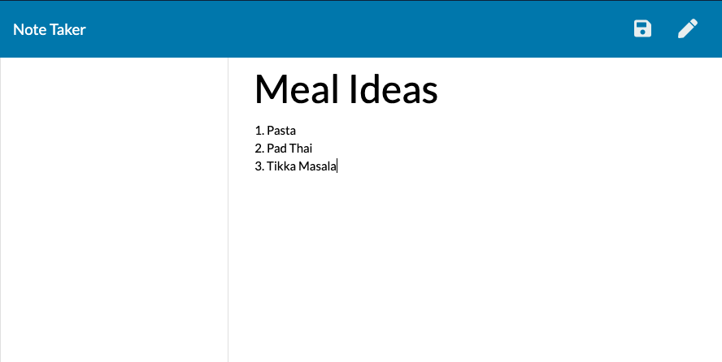

# Note-Taker

<!--  -->

 Click [Here](https://note-inscriber-app.herokuapp.com/) to view deployed note taking app

## About The Project

I created the server side interactions between the server and the client to: 

* Serve html files
* Get Saved notes from server
* Delete notes from server

Giving the user a minimal but effective note taking app to keep track of their thoughts throughout theday

### Features
* Create notes that can be opened from any device you would like
* Save notes to be view later
* Delete notes you are finished with

### Built With

* [Javascript](https://developer.mozilla.org/en-US/docs/Web/JavaScript)
* [Node.js](https://nodejs.org/en/docs/)
* [Express](https://www.npmjs.com/package/express)

<!-- GETTING STARTED -->
## Getting Started

* Click on the "Get Started" button on home screen
* You will be navigated to the note manipulation page
* From here you can write a note title and a body
* Then hit the save button in the top right corner of your screen
    * You must have a body to save each note or the save button will not show up
* You an create as many notes as you would like
* When you are done with a note
* You will click the icon to the left of each note
* This will delete your note forever so be sure that you don't want it anymore
* Have fun organizing your life!

### Home Page

<!--  -->

### Notes Page

<!--  -->

<!--  -->
